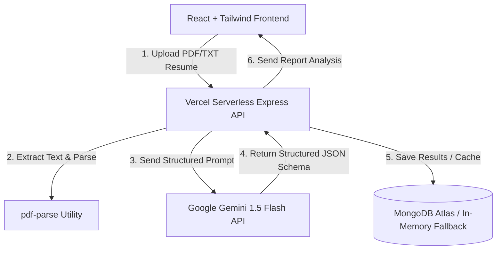

# 🚀 CareerSight AI

<p align="center">
  
  
  
  
  
  
  
</p>

---

## 📖 Overview

**CareerSight AI** is a state-of-the-art, full-stack resume analysis application designed to turn raw resume documents into clear, actionable career pathways. By leveraging the power of **Google Gemini AI Studio** (using structured JSON outputs), the app extracts tech skills, detects missing gaps, ranks overall suitability with a dynamic score, and lays out a customized 4-week timeline stepper for internship candidates.

The project features a **premium glassmorphic user interface** equipped with dual dark/light themes, drag-and-drop file upload capabilities, SVG progress gauges, and calculated role matching bars.

---

## ⚙️ Application Architecture



---

## ✨ Features

- 🎭 **Dual Theme Engine:** Features an elegant `midnight` dark mode and a crisp `aurora` light mode with floating background blobs.
- 📁 **Drag & Drop File Upload:** Custom interactive dashboard widget supporting PDF and plain text resume files under 2MB.
- 📊 **Dynamic SVG Score Ring:** High-resolution circular score indicators that change color dynamically (Green for 80+, Yellow for 50-79, Red for <50).
- 🏷️ **Technical Skill Tags:** Automatic keywords and tools extraction compiled into custom styled tags.
- 📈 **Internship Role Matcher:** Dynamically calculated progress match percentages for targeted internship positions.
- ⚠️ **Skills Gap Analysis:** Displays missing technical skills by role as amber warn badges.
- 🗓️ **4-Week Timeline Tracker:** Interactive roadmap stepper with checkable/expandable weekly goals.
- 🛡️ **Secure JWT Authentication:** Token-based student auth with pure-JS `bcryptjs` encryption for serverless stability.

---

## 📂 Project Structure

```
├── api/
│   └── index.js             # Vercel serverless function entrypoint
├── client/                  # Vite + React Frontend
│   ├── src/
│   │   ├── components/      # UI components (Dashboard, Login, Upload)
│   │   ├── App.jsx          # Theme manager & landing layout
│   │   ├── main.jsx         # Axios configs & render root
│   │   └── index.css        # Global CSS variables & keyframe animations
│   ├── vite.config.js       # Vite React plugin & closeBundle force-exit handler
│   └── package.json
├── server/                  # Node.js + Express Backend
│   ├── controllers/         # Auth and Resume analysis logic
│   ├── routes/              # Express routing rules
│   ├── utils/               # Gemini API schemas & db fallback states
│   ├── server.js            # Express app compiler & connection handler
│   └── package.json
├── vercel.json              # Vercel monorepo routing & output configuration
└── package.json             # Root NPM workspaces monorepo settings
```

---

## 🛠️ Local Development

This project uses **NPM Workspaces** to manage dependencies. You can install all frontend and backend dependencies in a single step from the root directory.

### 1. Installation
In the project root, run:
```bash
npm install
```

### 2. Configure Environment Variables
Create a `.env` file in the `server` directory:
```env
PORT=5000
JWT_SECRET=your_super_secret_jwt_key
MONGO_URI=your_mongodb_connection_string
GEMINI_API_KEY=your_google_ai_studio_gemini_key
```

### 3. Run the Backend
```bash
npm start --workspace=server
```
The server will run on `http://localhost:5000`. If no MongoDB URI is provided, it will automatically fall back to memory-store mode.

### 4. Run the Frontend
```bash
npm run dev --workspace=client
```
Open `http://localhost:5173` in your browser.

---

## 🚀 Production Deployment on Vercel

This repository is optimized to deploy both the frontend and backend on Vercel as a single monorepo under a unified domain.

1. Push your repository to GitHub.
2. Go to the [Vercel Dashboard](https://vercel.com/) and click **Add New Project**.
3. Import your **CareerSight AI** repository.
4. Keep the **Root Directory** as `./` (the root). Vercel will automatically read the root `vercel.json` file.
5. Set the following **Environment Variables** in the Vercel dashboard:
   
| Variable Name | Required | Description |
| :--- | :--- | :--- |
| `GEMINI_API_KEY` | Yes | Your Google Gemini API Studio Key (enables actual AI resume parsing). |
| `MONGO_URI` | Recommended | MongoDB connection string (avoids in-memory resets on cold starts). |
| `JWT_SECRET` | Recommended | Strong secret string used to sign session cookies. |

6. Click **Deploy**. Vercel will build the frontend assets, set up the serverless `/api/*` endpoints, and make the application live!
